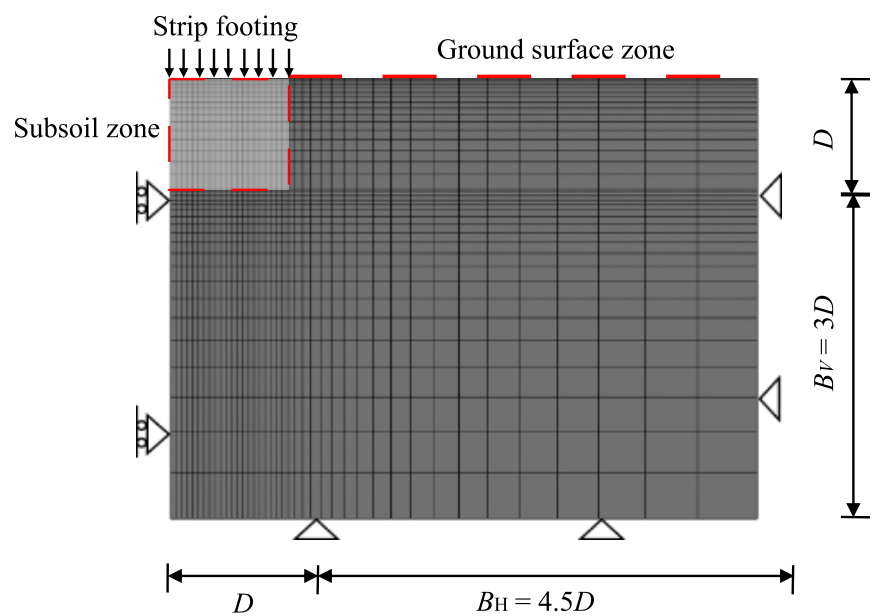
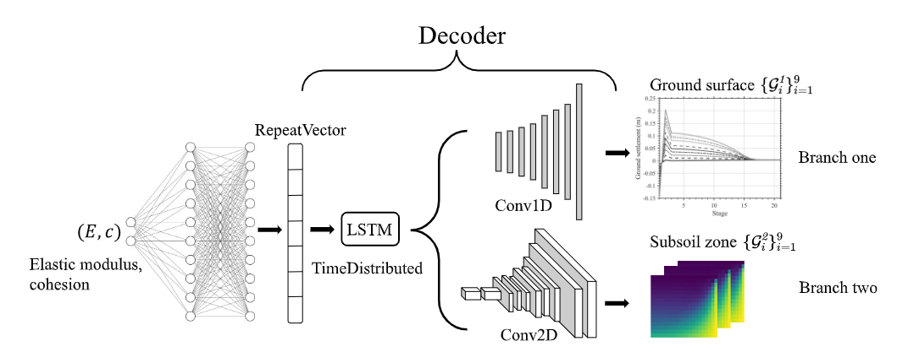
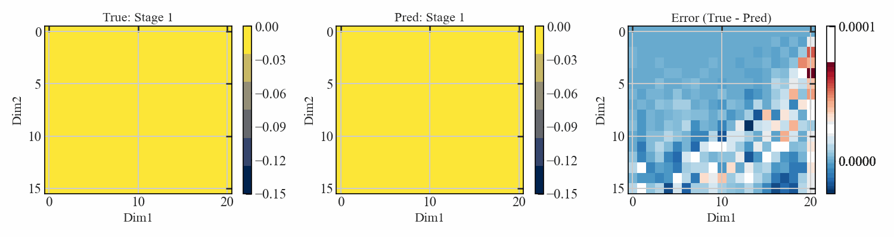

# Decoder-Only Neural Metamodel for Strip Footing Spatiotemporal Multi-Field Outputs"

This repository contains the Python based implementation of metamodel for geotechnical multi-stage, multi-output high-dimensional outputs.

A toy stripfooting problem is used, two types of outputs are generated: (1) ground surface settlement; (2) subsoil zone displacement.

A decoder only NN architecture is used:

And the results will be spatiotemporal predictions

- Vector displacement

- Field displacement
  

---

# Table of Contents

<!-- TOC depthFrom:2 depthTo:4 withLinks:1 updateOnSave:1 orderedList:0 -->

- [Files](#Overview)
- [Requirements](#Requirements)
- [Contact](#Contact)
<!-- /TOC -->

---

# Files 

This folder contains python code and data to reproduce the results in the associated paper. In particular, the provided scripts will gives you the NN architecture, hidden units and spatiotemporal restults envolving.

`stripfooting.ipynb` is the main file, all other python script with `.py` is the subroutines. `data.mat` is the FE input-output dataset. `requirements.txt` gives the virtual python envinorment.

---

# Requirements 

- Create a virtual envirnoment using conda
- Install `python=3.10` with commandl line `conda install python=3.10`
- Import all python-related packages from `requirements.txt`

`stripfooting.ipynb` is the main file, all other python script with `.py` is the subroutines. `data.mat` is the FE input-output dataset. `requirements.txt` gives the virtual python envinorment.

---

## Contact 

We are committed to open-source code and transparent, reproducible scientific research. All the data and figures in the paper are intended to be as reproducible as possible. If you encounter any issues using the code, please don't hesitate to reach out.

Ningxin Yang, n.yang23@imperial.ac.uk

